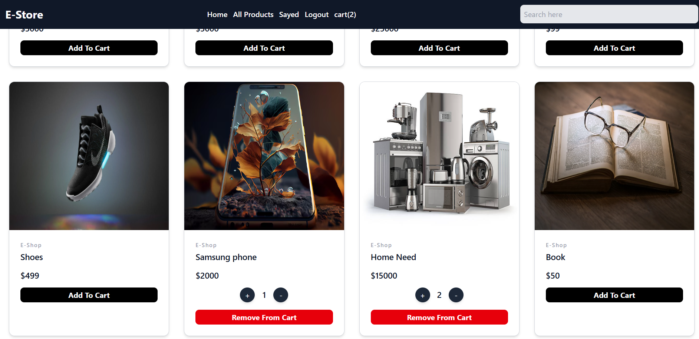
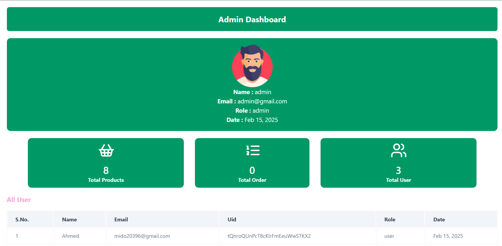

# 🚀 E-Commerce Web App

Welcome to my **E-Commerce Web App**—a fully functional online store built using **React** and powered by **Firebase** for real-time data management and authentication. This project showcases my expertise in frontend development, state management, and secure authentication.

## ⚡ Features

### 🔑 Authentication & Authorization

- **User & Admin Authentication** using Firebase.
- **Protected Routes** for both users and admins.
- **Secure login, register, and logout functionality.**

### 🛍️ Shopping Experience

- **Add, Remove, Increase, and Decrease products** in the shopping cart.
- **Real-time updates** with Firebase Firestore.
- **Dynamic product listing**—whenever a product is added, updated, or removed, the UI reflects changes instantly.

### 📦 Admin Dashboard

- **Add new products** with images, descriptions, and prices.
- **Edit existing products** dynamically.
- **Delete products** instantly from Firebase.
- **View orders** instantly from Firebase.

### 🎯 State Management

- **Redux & Context API** for seamless state handling.
- **Global state for authentication and cart management.**

## 🏗️ Technologies Used

- **React** (Frontend)
- **Redux Toolkit** (State Management)
- **Context API** (Theme & Language Handling)
- **Firebase Authentication** (Secure Login & Registration)
- **Firebase Firestore** (Real-time Database)
- **React Router** (Navigation & Protected Routes)
- **Tailwind** (For Built Ui)

## 🚀 Installation & Setup

```sh
# Clone the repository

# Navigate to project folder
cd E-STORE

# Install dependencies
npm install

# Start the development server
npm run dev
```

## 🔥 Screenshots




## 🤝 Contribution

Feel free to fork this project, open issues, and submit pull requests. Let's build something amazing together! 🚀

## 📩 Contact

If you have any questions or suggestions, connect with me:

- **LinkedIn:** [LinkedIn](https://www.linkedin.com/in/ahmed-khaled-fouda/)
- **GitHub:** [GitHub](https://github.com/Ahmed-K-Fouda/)

---

Made with ❤️ by **Ahmed Khaled Fouda** 🚀
